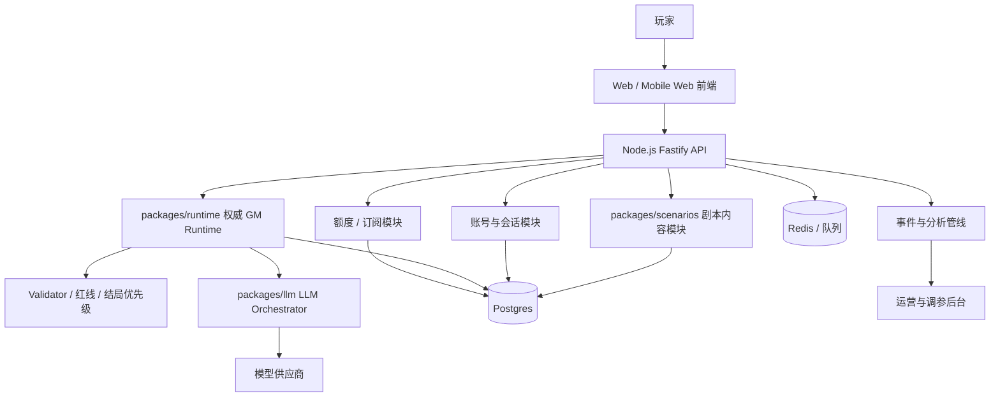
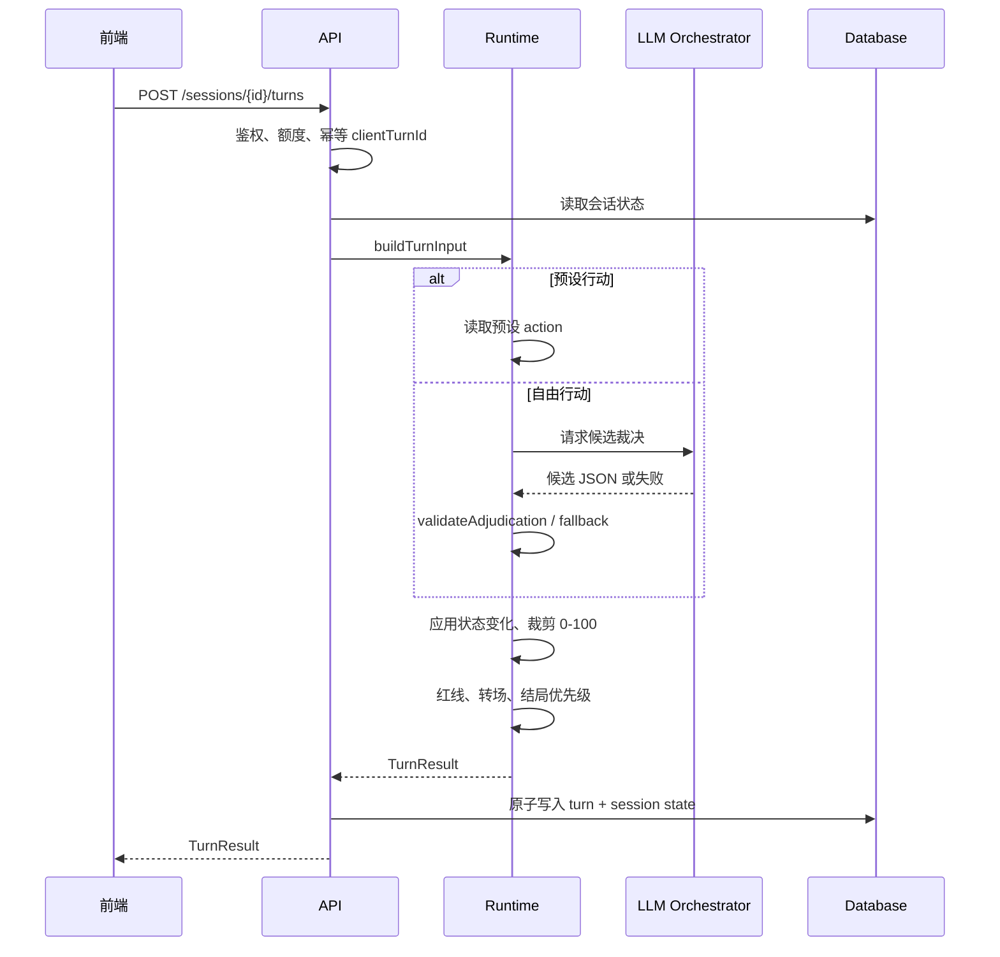

# What-If 商业化阶段 Node.js 前后端分离架构与实施计划

状态：商业化 Phase 1 架构草案，可进入实施拆解  
日期：2026-07-25  
适用阶段：用户已确认从高保真 demo 进入正式产品开发  
当前基线：`undercover-demon-king` 已验证核心 UI、六幕/七节点运行时和本地 GM 裁决；LLM 候选、validator、角色红线和服务端 Runtime 是商业化阶段需要迁移并补强的方向

## 1. 阶段判断

本文件在以下阶段切换决策后生效：

> 项目不再停留在 demo 阶段，正式进入商业化产品开发。

因此，`docs/product/game-development-playbook.md` 中“可玩运行时切片”阶段关于不引入 React、Vite、后端和构建工具的限制，不再约束本文描述的商业化 Phase 1。那些限制仍适用于维护旧静态 demo 或做玩法小实验。

What-If 现在不再只是验证“这个玩法是否成立”的静态 demo。下一阶段目标应切换为商业化产品：

- 用户可以登录、开始会话、保存进度、复玩和分享结局。
- 真实 LLM 调用只能发生在服务端，前端不保存或暴露模型密钥。
- GM、结局、红线、数值裁剪必须由服务端权威运行时决定。
- 剧本内容、角色配置、提示词、模型策略和结局阈值需要可版本化。
- 运营侧需要看到成本、失败率、玩家路径、结局分布和 LLM 质量问题。

因此，正式架构应从“静态页面 + 本地 JS 运行时”升级为“Node.js/TypeScript 前后端分离 + 服务端权威运行时 + 可插拔 LLM 编排”。

## 2. 核心原则

1. **后端是唯一裁决者**
   前端只提交玩家动作并展示结果。状态、旗标、转场、结局、红线、数值裁剪都由后端决定。

2. **LLM 只是候选生成器**
   LLM 可以理解自由文本、生成 GM 旁白和角色对白，但不能直接写入最终状态或结局。

3. **剧本是版本化内容资产**
   每个剧本有稳定 `scenarioId`、`version`、场景图、状态字典、结局规则、角色红线和 prompt 配置。

4. **商业能力不要污染玩法内核**
   账号、支付、额度、运营后台、埋点和风控放在产品服务层；GM Runtime 保持纯粹、可测试。

5. **先单体后拆服务**
   初期可以是一个后端 API 应用，内部按模块分层。等流量、成本或团队边界真实出现后再拆微服务。

6. **Node.js 作为统一产品运行时**
   正式产品第一阶段统一使用 Node.js + TypeScript。原因是当前 demo 已经是 JavaScript 运行时，GM 规则、validator、剧本配置和前端 contract 可以低成本迁移到共享包，减少“重写一套玩法”的风险。

## 3. Node.js 技术选型

推荐第一阶段技术栈：

| 层 | 推荐方案 | 说明 |
| :--- | :--- | :--- |
| 包管理 | `pnpm workspace` | 保持 monorepo 轻量，适合共享 runtime 和 contracts |
| 语言 | TypeScript | 前后端共享类型，减少字段漂移 |
| 后端框架 | Fastify | 性能好、插件轻、schema 友好；比重型框架更适合当前阶段 |
| API schema | Zod + JSON Schema 导出 | Runtime 输入输出、LLM 候选、DB payload 都先用同一套 schema 约束 |
| 数据库 | PostgreSQL | 会话、回合、用户、剧本版本、LLM 调用日志都适合关系型存储 |
| ORM | Prisma 或 Drizzle | Phase 1 可先内存存储，Phase 2 再接入；二选一即可，不要并存 |
| 缓存/队列 | Redis + BullMQ | Phase 2 后用于限流、异步分析、LLM 调用统计 |
| 测试 | Vitest | 适合 TypeScript 纯函数和 API 测试 |
| 前端 | React + Vite | 商业化阶段可以引入构建工具，保留当前移动端 UI 经验 |
| 部署 | Docker | API、Web、Postgres、Redis 可在本地和线上保持一致 |

第一阶段不建议使用：

- Next.js 全栈路由作为权威后端。What-If 的 GM Runtime 和 LLM 编排需要清晰服务边界，独立 API 更安全。
- 微服务。现在还没有真实流量和团队边界，先模块化单体。
- Serverless-only 架构。LLM 超时、重试、成本日志和会话事务会让纯函数式部署变复杂。

## 4. 总体架构



## 5. 前端职责

前端负责体验，不负责权威规则。

范围：

- 首页、剧本选择、会话开始。
- 游玩界面：场景、角色头像、GM 旁白、角色对白、状态变化、行动选择、自由输入。
- 异步状态：GM 思考中、LLM 降级、本地兜底、网络重试。
- 结局页：结局标题、因果解释、关键选择、分享卡。
- 用户区：历史会话、收藏结局、额度/订阅状态。
- 轻量运营实验：不同 UI 文案、状态展示密度、引导流程。

前端不得：

- 读取真实 LLM API key。
- 直接调用模型供应商。
- 自行判定结局。
- 自行修改数值状态。
- 信任本地缓存作为最终会话状态。

建议技术路线：

- 从当前静态 demo 抽取视觉和交互经验。
- 正式前端使用 React + Vite + TypeScript 单页应用。
- UI 合约通过共享 `contracts` 类型约束，避免前后端字段漂移。
- 不把 `src/app.js` 的本地状态机搬进前端；前端只保留渲染层和交互层。

## 6. 后端职责

后端是 What-If 的产品核心。

模块：

- `api-gateway`：HTTP API、鉴权、限流、错误码、请求日志。
- `session-service`：创建游玩会话、读取会话、提交回合、保存历史。
- `runtime-engine`：场景推进、状态裁剪、旗标写入、结局优先级、红线拦截。
- `llm-orchestrator`：prompt 打包、模型调用、超时中断、重试、降级、成本记录。
- `scenario-registry`：剧本版本、场景图、角色配置、结局配置、资源引用。
- `entitlement-service`：免费额度、订阅、付费次数、每日限制。
- `analytics-service`：事件采集、结局分布、掉线点、模型失败率。
- `admin-service`：剧本发布、阈值调参、LLM 输出审查、灰度配置。

## 7. 推荐仓库结构

正式产品可以从单仓库 monorepo 开始：

```text
what-if/
  apps/
    web/                 # React + Vite 前端应用
    api/                 # Node.js + Fastify 后端 API 应用
    admin/               # 后续运营后台，可第二阶段再建
  packages/
    contracts/           # Zod schema、API 类型、共享枚举
    runtime/             # GM Runtime、validator、结局优先级
    scenarios/           # 剧本内容、角色、场景矩阵、结局配置
    llm/                 # prompt builder、provider adapter、response parser
    ui/                  # 可选共享 UI 组件
  docs/
  legacy-demo/
    index.html
    src/
```

迁移时不必立刻删除当前 demo。建议先把当前 `index.html`、`src/app.js`、`src/styles.css` 作为 `legacy-demo` 或参考实现冻结，用它对照新系统是否保持同等玩法体验。

## 8. Node 包职责

### `packages/contracts`

只放稳定 schema 和类型：

- `ScenarioId`
- `SceneId`
- `StatKey`
- `FlagKey`
- `EndingKey`
- `ActionCategory`
- `Adjudication`
- `CreateSessionRequest`
- `SessionSnapshot`
- `TurnRequest`
- `TurnResult`
- `LLMAdjudicationCandidate`

所有 API 入参和 Runtime 入参都先过 contract 校验。

### `packages/scenarios`

只放内容配置，不放数据库连接、不放 HTTP 逻辑：

- 状态定义和初始值。
- 旗标定义和默认值。
- 场景图。
- 每场景允许行动、禁止行动、合法转场、允许结局。
- 角色维度、压力阈值、红线、结局底线。
- 预设行动。
- 结局定义和优先级配置。
- prompt 片段。

### `packages/runtime`

纯函数优先：

- `createInitialSessionState(scenario)`
- `applyPresetTurn(input)`
- `applyFreeTextTurn(input, llmCandidate?)`
- `validateAdjudication(candidate, context)`
- `validateEndingCandidate(endingKey, context)`
- `verifyCharacterRedLines(context)`
- `determineEnding(context)`
- `buildTurnResult(context)`

该包不能读取环境变量、不能调用网络、不能连接数据库。

### `packages/llm`

服务端专用：

- `buildPromptContext(runtimeContext)`
- `callProvider(prompt, options)`
- `parseLLMJson(raw)`
- `requestAdjudicationCandidate(input)`
- provider adapter：Doubao/OpenAI/其他模型。

该包不能直接修改会话状态，只返回候选。

### `apps/api`

组合层：

- Fastify server。
- 鉴权、限流、额度。
- session repository。
- 调用 runtime 和 llm。
- 写入 turns、sessions、llm_calls。
- 返回前端 contract。

## 9. API 合约草案

### 9.1 创建会话

```http
POST /api/v1/sessions
```

请求：

```json
{
  "scenarioId": "undercover-demon-king",
  "scenarioVersion": "1.0.0"
}
```

响应：

```json
{
  "sessionId": "ses_...",
  "scenarioId": "undercover-demon-king",
  "scenarioVersion": "1.0.0",
  "currentScene": {},
  "stats": {},
  "flags": {},
  "availableActions": []
}
```

### 9.2 提交回合

```http
POST /api/v1/sessions/{sessionId}/turns
```

请求：

```json
{
  "actionType": "preset",
  "presetActionId": "gate_deceive_spirit",
  "freeText": null,
  "clientTurnId": "uuid"
}
```

自由行动：

```json
{
  "actionType": "free_text",
  "presetActionId": null,
  "freeText": "我解释这是古代因果诱导阵。",
  "clientTurnId": "uuid"
}
```

响应：

```json
{
  "turnId": "turn_...",
  "adjudication": "costly_success",
  "narration": "GM 旁白",
  "stateDelta": {},
  "stateAfter": {},
  "flagUpdates": {},
  "focusedCharacters": ["ivette", "leon"],
  "characterResponses": [],
  "evidenceLog": [],
  "nextScene": {},
  "ending": null,
  "debug": {
    "runtimeVersion": "1.0.0",
    "llmUsed": true,
    "fallbackUsed": false
  }
}
```

生产环境默认不向普通用户返回完整 `debug`，但应在内部日志中保留。

### 9.3 读取会话

```http
GET /api/v1/sessions/{sessionId}
```

返回当前状态、历史回合、结局和可用行动。用于刷新页面、跨设备继续、分享结局。

### 9.4 重新开始或复玩

```http
POST /api/v1/sessions/{sessionId}/restart
POST /api/v1/sessions/{sessionId}/fork
```

`restart` 创建同剧本新会话。  
`fork` 从某一回合前复制状态，用于商业化后的“从这里重试”。

## 10. 后端回合流程



关键点：

- 一次回合写入必须是原子操作。
- `clientTurnId` 必须防重复提交。
- LLM 超时后只能应用 fallback，一次回合不能后补覆盖。
- Runtime 输出必须完整记录“为什么这么判”。

## 11. 数据模型草案

### users

- `id`
- `email` / OAuth identity
- `display_name`
- `created_at`
- `last_seen_at`

### scenarios

- `id`
- `slug`
- `title`
- `status`: draft / staging / published / archived
- `latest_version`

### scenario_versions

- `id`
- `scenario_id`
- `version`
- `content_json`
- `runtime_contract_version`
- `published_at`

### play_sessions

- `id`
- `user_id`
- `scenario_id`
- `scenario_version`
- `status`: active / ended / abandoned
- `current_scene_id`
- `stats_json`
- `flags_json`
- `ending_key`
- `created_at`
- `updated_at`

### turns

- `id`
- `session_id`
- `turn_index`
- `scene_id`
- `action_type`
- `action_text`
- `preset_action_id`
- `adjudication`
- `state_delta_json`
- `state_after_json`
- `flag_updates_json`
- `narration`
- `character_responses_json`
- `evidence_log_json`
- `ending_key`
- `created_at`

### llm_calls

- `id`
- `session_id`
- `turn_id`
- `provider`
- `model`
- `prompt_version`
- `input_tokens`
- `output_tokens`
- `latency_ms`
- `status`: success / timeout / invalid_json / validation_failed / provider_error
- `cost_estimate`
- `created_at`

### entitlements

- `user_id`
- `plan`
- `free_turns_remaining`
- `paid_turns_remaining`
- `daily_limit`
- `renew_at`

## 12. Runtime 规则边界

服务端 Runtime 必须实现并测试：

- 状态字段白名单。
- 数值裁剪到 `0-100`。
- 单回合 LLM delta 限制，例如 `-30..+30`。
- 当前场景允许行动分类。
- 当前场景合法转场。
- 当前场景允许结局。
- 角色红线。
- 结局优先级。
- LLM 失败 fallback。
- 会话幂等。
- 同一输入在同一状态下输出确定性结果，LLM 候选只影响文案和候选 delta，不能改变硬规则。
- Runtime 返回 `decisionTrace`，记录命中的规则、被拒绝的 LLM 字段、结局候选来源和 fallback 原因。

前端可以展示这些规则的结果，但不能绕过它们。

## 13. LLM 编排策略

正式产品的 LLM 层应拆成四步：

1. **Prompt Context Builder**
   只打包当前回合必要上下文：场景、破绽、状态、旗标、焦点角色、允许行动、禁止行动、最近 3-5 回合摘要。

2. **Provider Adapter**
   统一不同模型供应商返回格式。模型 key、base URL、重试策略只在后端环境变量或密钥管理里存在。

3. **Response Parser**
   只接受严格 JSON。解析失败立即 fallback，并记录失败样本。

4. **Adjudication Validator**
   把 LLM 候选变成可执行候选；非法字段丢弃，越权转场/结局拒绝，必要时完全 fallback。

商业化默认策略：

- 免费用户：优先低成本模型 + 严格超时 + fallback。
- 付费用户：更高质量模型或更长上下文。
- 高风险输出：不重试多次烧成本，直接本地 fallback。
- 所有 LLM 调用记录成本和失败原因。

## 14. 账号、额度与付费

账号、额度与付费属于 Phase 4，不属于当前 Phase 1 的实施范围。

Phase 1 只需要在 API 和 contracts 设计中避免阻断后续接入，例如保留可选 `userId`、匿名会话和额度错误码的位置，但不要实现真实账号、支付、订阅或额度扣减。

Phase 4 的最小闭环可以包括：

- 匿名试玩：允许有限回合或一个短会话。
- 登录用户：保存历史、获得每日免费额度。
- 付费用户：更高每日额度、更多存档、重试或 fork 能力。
- 额度扣减单位建议为“自由行动 LLM 回合”，预设行动成本更低或不扣。

注意：不能让支付逻辑进入 Runtime。Runtime 只处理玩法，额度在 API 层进入回合前检查。

## 15. 运营后台

运营后台属于 Phase 5，不属于当前 Phase 1 的实施范围。

Phase 1 只需要让 `decisionTrace`、turn result 和后续 `llm_calls` 数据模型预留可观测字段。真正的后台页面、dashboard、灰度发布和 prompt 对比放到 Phase 5。

Phase 5 的内部视图可以包括：

- 每日会话数、完成率、平均回合数。
- 各结局命中分布。
- 每个场景的流失率。
- 自由行动 LLM 成功率、fallback 率、非法 JSON 率。
- 单用户和全局模型成本。
- 被 validator 拒绝最多的字段和原因。
- 高风险结局路径抽样回放。

这些数据会反向指导：

- 哪些场景太难理解。
- 哪些结局不可达或太容易。
- 哪些角色对白不像角色。
- 哪些 prompt 或 validator 需要收紧。

## 16. 安全与合规边界

必须做到：

- API key 只存在服务端。
- 所有用户输入做长度限制和基础清洗。
- 每回合请求有速率限制。
- LLM 输出不能直接返回未校验字段。
- 管理后台和 prompt 调试接口必须鉴权。
- 日志中避免记录敏感账号信息。
- 分享页只暴露结局和可公开的回合摘要，不暴露完整内部状态或 prompt。

## 17. Silicon Factory 集成位置

商业化第一版不应该阻塞在 Silicon Factory 上。推荐顺序：

1. What-If 后端先内置剧本、角色、红线和 prompt。
2. 当首个剧本付费闭环跑通后，再把角色人格包、记忆种子和多 Agent 编排需求反馈给 Silicon Factory。
3. Silicon Factory 未来作为上游内容/人格供应方，不直接接管 What-If Runtime。

接口边界：

- What-If 请求：角色人格包、说话风格、价值观、记忆种子。
- What-If 保留：会话状态、GM 裁决、结局优先级、商业策略。

## 18. 实施路线

### Phase 0：冻结 demo 为产品参照

目标：

- 当前 demo 不再继续堆商业逻辑。
- 修掉前端直连 LLM 的风险，或明确标记为废弃路径。
- 用 QA 文档确认核心玩法基线。

交付：

- 当前静态 demo 归档为 reference。
- Runtime v1 规格与代码行为同步。
- 至少一份正式产品架构文档，即本文。

### Phase 1：后端权威 Runtime

目标：

- 把 `src/app.js` 中的场景、状态、validator、结局规则抽成服务端 runtime。
- 暴露创建会话、提交回合、读取会话 API。
- 给前端 API 化准备好 contract 和返回结构；本阶段不强制重写前端或让现有 demo 接入 API。

交付：

- `apps/api`：Node.js + Fastify
- `packages/runtime`：纯 TypeScript 规则引擎
- `packages/contracts`：Zod schema 和共享类型
- `packages/scenarios`：版本化剧本配置
- `POST /sessions`
- `POST /sessions/{id}/turns`
- `GET /sessions/{id}`
- Runtime 单元测试和回合 smoke test。

### Phase 2：真实 LLM 服务端接入

目标：

- 自由行动通过后端 LLM Orchestrator 生成候选。
- Validator 决定是否接受。
- 超时、非法 JSON、越权输出全部 fallback。

交付：

- `packages/llm`
- prompt versioning
- `llm_calls` 成本记录
- AbortController/超时中断
- validator rejection metrics

### Phase 3：正式前端应用

目标：

- 用 API 驱动正式产品前端。
- 保留当前 demo 已验证的移动端体验，但切掉本地权威状态。

交付：

- `apps/web`
- 剧本选择页
- 游玩页
- 结局页
- 历史会话页
- 网络错误和 LLM fallback 状态

### Phase 4：账号、额度、付费闭环

目标：

- 支持匿名试玩、登录保存、额度限制和付费转化。

交付：

- Auth
- Entitlement
- 额度扣减
- 基础订阅/购买记录
- 支付回调幂等处理

### Phase 5：运营与调参后台

目标：

- 让剧本、阈值、prompt、模型成本能被观察和调整。

交付：

- 运营 dashboard
- 结局分布
- 场景流失
- LLM 失败样本
- prompt 版本对比
- 灰度发布

## 19. 第一批实施任务

建议下个 agent 先做这 8 件事：

1. 建立 `apps/api`、`packages/runtime`、`packages/contracts`、`packages/scenarios` 的最小目录。
2. 配置 `pnpm workspace`、TypeScript、Vitest、Fastify。
3. 从 `src/app.js` 抽出 Runtime v1 的纯函数：初始化状态、应用回合、validateAdjudication、validateEndingCandidate、determineEnding。
4. 把 `undercover-demon-king` 场景、状态、旗标、结局迁移为版本化 scenario config。
5. 定义 `CreateSessionRequest`、`TurnRequest`、`TurnResult` 的共享 contract。
6. 实现内存版 API，不急着接数据库，先让前端可通过 API 玩完整局。
7. 加服务端 runtime tests，覆盖当前 `runtime-smoke-test` 的全部规则。
8. 禁止前端真实 LLM 直连，只保留服务端接口占位。
9. 写一份迁移 checklist，确保现有 demo 的每个结局仍能到达。

## 20. 验收标准

进入商业化 Phase 1 完成时，必须满足：

- 前端不再持有权威状态。
- 浏览器不会直接调用模型供应商。
- 刷新页面后可以从后端恢复会话。
- 同一会话同一回合重复提交不会重复结算。
- LLM 失败时仍能完成整局。
- 每个结局仍由确定性规则触发。
- 所有状态、旗标、场景、结局 key 都有 schema 校验。
- 至少保留一个端到端 smoke test：创建会话 -> 提交多回合 -> 到达结局。

## 21. 暂不做事项

第一轮商业化架构迁移中不要做：

- 剧本市场。
- 多人实时协作。
- 完整剧本编辑器。
- 复杂推荐系统。
- 语音、视频、长动画生产管线。
- 把 Runtime 移回 Persona Library。

这些能力以后可能需要，但现在最重要的是让首个剧本在 Node.js 正式产品架构下安全、稳定、可付费地跑起来。
