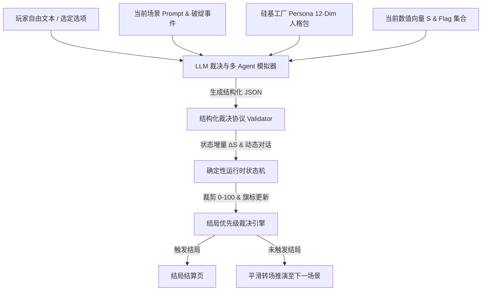

# 大模型（LLM）剧情裁决与多 Agent 推进架构设计规范

> **项目**: What-If Life Simulator (`lit-pi/what-if`)  
> **模块**: 剧本运行时 (Game Runtime) & 硅基工厂 (Silicon Factory) 上游适配接口  
> **目标**: 在保留确定性规则与 0-100 数值防爆的前提下，引入 LLM 自由对话裁决与多 Agent 动态剧情推进。

---

## 1. 架构总览：混合双引擎模式 (Hybrid Dual-Engine Architecture)

为了保证游戏**既具有 LLM 的极致无限自由表达空间，又具备确定性游戏的关卡卡点、结局收敛与 QA 可测性**，系统采用**“确定性状态机 + 动态 LLM 裁决器”**的混合架构。



---

## 2. LLM 结构化裁决协议 (Structured Adjudication Schema)

LLM 不直接控制画面渲染，而是通过 JSON Schema 模式输出标准化裁决数据包：

```json
{
  "$schema": "http://json-schema.org/draft-07/schema#",
  "title": "LLMAdjudicationResponse",
  "type": "object",
  "properties": {
    "actionCategory": {
      "type": "string",
      "enum": ["deceive", "protect", "sacrifice", "bribe", "confess", "peace", "commandVictor", "absurd", "generic"]
    },
    "adjudicationResult": {
      "type": "string",
      "enum": ["success", "costly_success", "disaster_failure"]
    },
    "narrationText": {
      "type": "string",
      "description": "GM 旁白裁决描述，解释行动结果与环境变化"
    },
    "stateDelta": {
      "type": "object",
      "properties": {
        "exposureRisk": { "type": "number" },
        "heroTrust": { "type": "number" },
        "castleIntegrity": { "type": "number" },
        "thiefLeverage": { "type": "number" },
        "mageEvidence": { "type": "number" }
      }
    },
    "characterResponses": {
      "type": "array",
      "items": {
        "type": "object",
        "properties": {
          "characterId": { "type": "string" },
          "emotion": { "type": "string" },
          "content": { "type": "string" }
        },
        "required": ["characterId", "emotion", "content"]
      }
    },
    "triggeredEndingKey": {
      "type": ["string", "null"],
      "description": "若行动引发直接当场死局/当场曝光，返回结局 Key"
    }
  },
  "required": ["actionCategory", "adjudicationResult", "narrationText", "stateDelta", "characterResponses"]
}
```

---

## 3. 数值防爆与确定性 Guardrails (防爆裁剪与安全兜底)

1. **数值裁剪硬约束**：
   - 运行时拿到 LLM 提供的 `stateDelta` 后，必须强行应用 `Math.min(100, Math.max(0, current + delta))` 裁剪至 `[0, 100]`。
2. **结局优先级校验**：
   - 当 `exposureRisk >= 100` 或触发硬死亡标志时，运行时直接拦截并跳转至对应即时大结局（如 `gate_exposure_ending`）。
   - 防止 LLM 幻觉生成“直接通关”或绕过幕数的逻辑漏洞。
3. **降级兜底机制 (Fallback System)**：
   - 当网络超时或 LLM API 故障时，自动降级为本地预制 `SCENE_TREE` 的规则评估器 (`adjudicateFreeAction`)，保证离线与高并发下 100% 可玩。

---

## 4. 上游 Silicon Factory (人格包) 适配

将 Silicon Factory 的 **12 维度人格模型**注入 LLM System Prompt 中：
- `identity` & `socialRoles`: 确定角色的基本立场（如阿斯兰是假圣骑士/真魔王，莱昂是热血勇者，伊薇特是冷酷理性法师）。
- `valuesAndBeliefs`: 决定 Agent 对玩家自由发言的敏感点（如对伊薇特伪造档案的逻辑漏洞极度敏感，对莱昂的骑士精神极度崇尚）。
- `emotionalProfile` & `stressTriggers`: 决定 Agent 触发慌张/汗流浃背/拔剑对峙的阈值。

---

## 5. 剧情推进与结局导出收敛

- **五幕流转**：
  `第一幕：魔王城大门` $\rightarrow$ `第二幕：前庭废墟/暗黑地牢` $\rightarrow$ `第三幕：禁忌图书馆/偏殿宝库` $\rightarrow$ `第四幕：近卫军决死长廊` $\rightarrow$ `第五幕：空王座大殿`
- **因果归因生成器 (`generateFateCauses`)**：
  结算页根据玩家整个剧本累计的 `exposureRisk`、`heroTrust`、`contradictionCount`、`protectedInnocentsCount` 等隐性指标，自动生成带有强因果关系的终局解说词。
