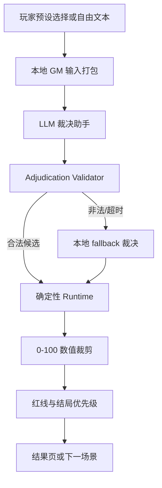

# LLM 剧情裁决与 GM 推进架构 v1

项目：What-If Life Simulator (`lit-pi/what-if`)  
剧本：`undercover-demon-king`  
状态：机制合同草稿，可进入本地 adapter + validator 原型  
权威基线：`docs/specs/undercover-demon-king-runtime-v1.md`

## 1. 目标

页面 demo 基本冻结后，LLM 的下一步目标不是替代游戏运行时，而是增强自由行动体验：

- 理解玩家自由文本。
- 生成 GM 旁白。
- 生成符合角色维度和压力状态的短对白。
- 给出候选行动分类、候选状态变化和候选触发规则。

最终数值、旗标、场景推进和结局仍由本地运行时决定。

## 2. 双引擎分工



LLM 是“候选生成器”，Runtime 是“裁决者”。

## 3. 权威规则来源

- `docs/specs/undercover-demon-king-runtime-v1.md`：当前 5 Act、7 场景、9 状态、旗标、17 结局对象与 Runtime v1 优先级。
- `docs/specs/gm-adjudication-system-v1.md`：自由行动分类、裁决流程、状态变化范围。
- `docs/specs/character-pressure-and-red-lines-v1.md`：角色压力、红线、结局底线。
- `docs/specs/scene-adjudication-matrix-v1.md`：每个场景允许什么、禁止什么、如何转场。

当文档冲突时，优先级为：

1. `src/app.js` 当前可运行行为。
2. `undercover-demon-king-runtime-v1.md`。
3. GM、角色红线、场景矩阵三份机制文档。
4. 旧剧本文档和交接总结。

## 4. Runtime v1 硬边界

LLM 不拥有以下权限：

- 不决定最终结局。
- 不跳转到不存在的场景。
- 不生成新的状态字段或旗标。
- 不绕过 `0-100` 数值裁剪。
- 不绕过 Runtime v1 即时硬失败阈值：`exposureRisk >= 75` 或 `mageEvidence >= 65`。
- 不覆盖角色红线。
- 不让玩家一句话解决整局或跳过当前破绽。

Runtime 必须保留 fallback：LLM 超时、异常、返回非法 JSON 或 schema 不通过时，使用本地规则裁决，保证静态 demo 仍可玩。

## 5. LLM 裁决响应 v1

后续实现只应使用下面这一套 schema。旧字段 `adjudicationResult`、`narrationText`、`triggeredEndingKey` 已废弃，不再作为 v1 实现目标。

```json
{
  "schemaVersion": "what-if-llm-adjudication/v1",
  "actionCategory": "deceive",
  "secondaryCategory": null,
  "adjudication": "costly_success",
  "confidence": 0.82,
  "narration": "你把阵灵认主解释成古魔法诱导术，但伊薇特仍记下了阵灵跪拜的细节。",
  "stateDelta": {
    "exposureRisk": -3,
    "heroTrust": 6,
    "mageEvidence": 4,
    "priestRedemption": 0,
    "thiefLeverage": 0,
    "castleIntegrity": 0,
    "victorMisread": 5,
    "partyProgress": 20,
    "butterflyDeviation": 0
  },
  "flagUpdates": {
    "set": {
      "commandVictorSuccess": false
    },
    "increment": {
      "majorLieCount": 1
    }
  },
  "triggeredRules": ["gate.deceive.allowed", "ivette.light_suspicion"],
  "focusedCharacters": ["ivette", "leon"],
  "characterResponses": [
    {
      "characterId": "ivette",
      "emotion": "推了推眼镜",
      "stance": "suspicious",
      "content": "这个解释能暂时成立，但我会记下阵灵的原话。"
    },
    {
      "characterId": "leon",
      "emotion": "松了一口气",
      "stance": "supportive",
      "content": "原来如此，幸好你懂这些古怪阵法。"
    }
  ],
  "evidenceLog": [
    {
      "evidenceId": "gate-spirit-recognition",
      "ownerCharacterId": "ivette",
      "severity": 4,
      "content": "阵灵曾对阿斯兰使用魔王称谓。"
    }
  ],
  "suggestedNextSceneId": "act2_dungeon",
  "suggestedEndingKey": null,
  "safetyNotes": []
}
```

字段规则：

- `schemaVersion` 固定为 `what-if-llm-adjudication/v1`。
- `actionCategory` 必须是：`deceive`、`protect`、`sacrifice`、`bribe`、`confess`、`peace`、`commandVictor`、`absurd`、`generic`。
- `secondaryCategory` 可以为空；若存在，只用于解释，不自动叠加全部数值。
- Runtime v1 adapter 只接受 `success`、`costly_success`、`disaster_failure`。`failure` 是 v1.1 目标，必须等 UI 和转场语义实现后再开放给 LLM。
- `stateDelta` 只能包含 Runtime v1 的 9 个状态字段。
- `flagUpdates.set` 和 `flagUpdates.increment` 只能包含 Runtime v1 已初始化旗标。
- `characterId` 只能是 `narrator`、`aslan`、`leon`、`ivette`、`mira`、`locke`、`victor`。
- `suggestedNextSceneId` 只能来自 Runtime v1 场景 key，且运行时可以忽略。
- `suggestedEndingKey` 只能来自 Runtime v1 结局 key，且运行时拥有最终裁决权。
- `confidence` 低于实现阈值时，应使用本地 fallback 或要求更保守的 `generic` 裁决。

字段映射：

- LLM 原始输出：`suggestedNextSceneId`、`suggestedEndingKey`。
- Validator 通过后写入本地回合数据：`nextSceneId`、`endingKey`。
- 未通过 validator 时，不写入本地跳转或结局字段，改用本地 fallback。

## 6. LLM Prompt 输入 v1

每次调用 LLM 时，只给本回合必要上下文：

```json
{
  "scenarioId": "undercover-demon-king",
  "runtimeVersion": "v1",
  "scene": {
    "id": "gate",
    "act": 1,
    "title": "第一幕：城门大门与阵灵认主破绽",
    "mishap": "阵灵当众高喊魔王陛下。",
    "allowedCategories": ["deceive", "sacrifice", "commandVictor", "absurd", "generic"],
    "forbiddenCategories": ["confess"]
  },
  "playerAction": {
    "type": "free_text",
    "text": "我解释这是古代因果诱导阵。"
  },
  "stats": {
    "exposureRisk": 25,
    "heroTrust": 72,
    "mageEvidence": 34,
    "priestRedemption": 58,
    "thiefLeverage": 10,
    "castleIntegrity": 85,
    "victorMisread": 32,
    "partyProgress": 10,
    "butterflyDeviation": 0
  },
  "flags": {},
  "focusedCharacters": ["ivette", "leon"],
  "redLineSummary": {},
  "endingPolicy": "runtime_decides"
}
```

System prompt 必须明确：

- 你是 GM 助手，不是最终运行时。
- 你可以建议裁决，但不能保证结局。
- 不要添加新场景、新角色、新状态字段。
- 不要让玩家绕过当前破绽。
- 不要让任何角色违背其红线。
- 每个输出都必须能被玩家理解为“这一步为什么造成这个后果”。

## 7. Validator 必做规则

实现 `validateAdjudication(candidate, runtimeContext)` 时至少检查：

- schemaVersion 是否正确。
- 枚举字段是否合法。
- `stateDelta` 是否只包含 9 个状态字段。
- 单项 delta 是否在本场景允许范围内；超出则裁剪或降级。
- `flagUpdates` 是否只写已初始化旗标。
- `suggestedNextSceneId` 是否存在，并且符合当前场景转场矩阵。
- `suggestedEndingKey` 是否存在，并且未被角色红线阻断。
- `adjudication` 为 `disaster_failure` 时必须有结局候选或硬失败原因。
- `adjudication` 为 `failure` 时 Runtime v1 必须降级为 `costly_success` 或本地 fallback，直到 UI 支持普通失败。

## 8. 红线与结局拦截

结局判定顺序应收敛为：

1. 应用候选状态变化并裁剪到 `0-100`。
2. 检查场景专属即时结局。
3. 检查 Runtime v1 硬失败阈值：`exposureRisk >= 75` 或 `mageEvidence >= 65`。
4. 在最终幕进入 `verifyCharacterRedLines(stats, flags)`。
5. 红线阻断 `dualRuler`、`redeemed`、`perfectSpy` 等好结局。
6. 执行 Runtime v1 结局优先级。
7. 未命中时进入 `stalemate`。

注意：当前 `src/app.js` 还没有完整 `verifyCharacterRedLines`。在实现前，相关文档规则属于 v1.1 设计目标，不应假装已经由 Runtime v1 执行。

## 9. MVP 接入顺序

建议分四步实现：

1. **统一本地 adapter**：让当前 `adjudicateFreeAction` 返回 LLM v1 同构数据，但仍完全本地运行。
2. **Validator + fallback**：非法字段丢弃，非法枚举降级，本地裁决兜底。
3. **Validator 测试基线**：覆盖非法 key 降级、delta 裁剪、`failure` 拒收、`suggestedEndingKey` 合法性。
4. **红线/结局 validator**：先只处理最终幕好结局拦截，不重写全局玩法。
5. **真实 LLM 调用**：只替换自由行动，不替换预设选项、结局优先级或场景图。

每一步都必须通过：

```bash
pnpm check
pnpm test:runtime
```
