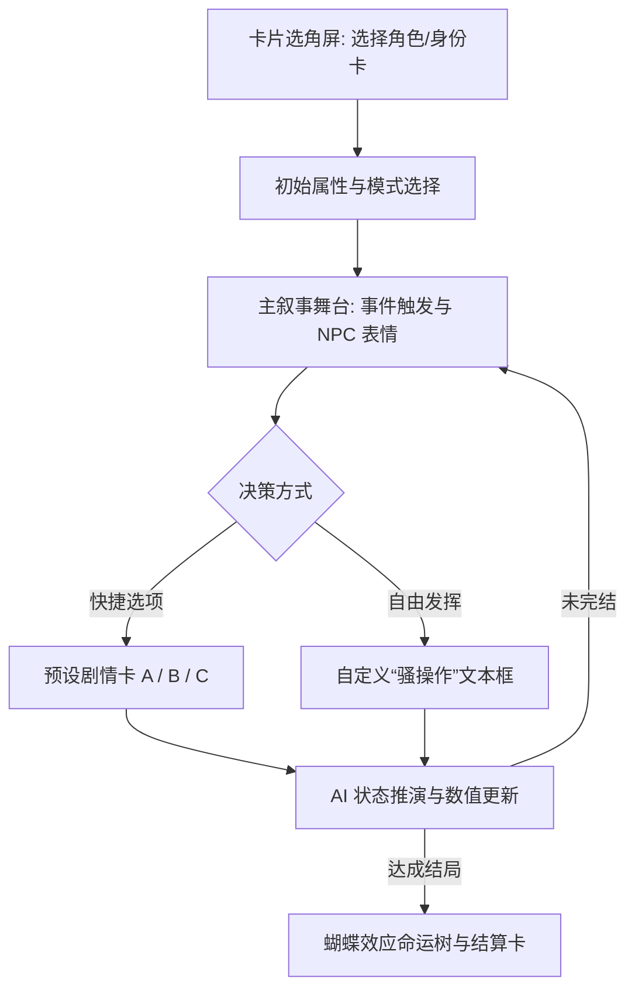

# “假如我是xxx” 交互方案设计与剧本选型 (包含 11 个原创高概念剧本)

## 1. 概述与定位

“假如我是xxx”（What-If Life Simulator）是一种结合了**AI 动态世界推演、蝴蝶效应因果链与第一视角角色扮演**的全新互动模式。

用户选择扮演某个特定角色，在关键剧情节点做出选择（或输入自由“骚操作”），AI 大模型作为“世界 GM”实时推演后续发展，影响状态数值，并最终输出**“蝴蝶效应命运树”**与**“人生结算卡”**。

---

## 2. 核心 UI/UE 交互方案设计 (Mobile Web)

参考《历史模拟器》、《筑梦岛》、《捏Ta》的优秀体验，采用以下 3 步交互流：

### 2.1 界面 1：角色与初始设定屏 (`/what-if/select`)
*   **剧本海报卡片**：展示剧本主题（如《末日避难所：AI 调度员》）、初始危机（如“氧气临界值警报”）。
*   **初始属性分配**：玩家可通过加点或抽卡设定初始数值（如：`理性值`、`道德底线`、`蝴蝶偏离度 %`）。
*   **模式选择**：
    *   *轻松爆笑模式*（容错率高，AI 倾向于顺应骚操作）。
    *   *硬核生存模式*（严格因果校验，离谱选择会导致猝死重开）。

### 2.2 界面 2：主叙事与决策舞台 (`/what-if/play`)
*   **顶部状态仪表盘 (State Bar)**：
    *   实时显示：生存率/资源储备、NPC 信任度、蝴蝶偏离度（显示“蝴蝶翅膀煽动幅度”）。
*   **中部剧情叙事区 (Narrative Stage)**：
    *   **动态剧情推演**：AI 以精炼流畅的文笔描述当前遭遇（支持配图/配音）。
    *   **出场 NPC 头像与态度**：右侧或顶部展示当前干预 NPC 的微立绘与态度（如“科学家：极度焦虑 😨”）。
*   **底部决策控制区 (Decision Footer)**：
    *   **预设分支卡**：提供 2-3 个剧情分支按钮（如：`[选项A] 开启紧急供氧`、`[选项B] 强制要求投决`）。
    *   **自由“骚操作”输入框 (Custom Action)**：允许玩家自由输入文本（如：“断掉整个 B 区的电力，强行把废弃空罐接入主循环”），由 AI 实时推演非预设结果！

### 2.3 界面 3：蝴蝶效应命运树与结算屏 (`/what-if/result`)
*   **底特律式树状图 (Butterfly Effect Node Tree)**：
    *   折叠/展开展示玩家从开局到结局的每一个决策节点。
*   **人生总结卡（成就分享图）**：
    *   生成可保存/分享的精美卡片（如：`称号：冷酷机械师`、`生存率：3/6 人`），方便社交传播。

---

## 3. 剧本选型矩阵：11 个原创高概念剧本 (无 IP 限制 / 高爆款潜力)

这些剧本**完全没有版权风险与同质化竞争**，全靠强反差设定、戏剧冲突与脑洞张力吸引用户：

| 剧本名称 | 核心角色视角 | 开局节点与核心矛盾 | 体验亮点与新意 |
| :--- | :--- | :--- | :--- |
| **1. 《假如我是末日避难所的 AI 调度员》** *(道德电车难题)* | 基地最高 AI 调度员 | 太阳风暴爆发，避难所 6 个人，但氧气只够 3 个人活到救援队赶来 | **极强的人性博弈**！每个 NPC 都在试图说服你放他们进舱，极具冲击力。 |
| **2. 《假如我是前任脑海里的记忆消除师》** *(赛博情感反转)* | 赛博记忆工程技术员 | 你正在清理一个前任关于你的记忆，你可以选择删除、篡改或悄悄留下暗号 | **深情与遗憾的撕扯**！关于爱与选择，充满赛博朋克的浪漫与悲凉。 |
| **3. 《假如我是首富家的猫，但听懂了谋杀计划》** *(萌宠解谜搞笑)* | 一只奢华生活英短猫 | 听见管家密谋今晚绑架主人，你无法说话，只能靠猫的本能传递信号 | **萌宠+解谜**！打翻咖啡、叼走钥匙、挠坏沙发，用猫的“骚操作”救主，爆笑无比。 |
| **4. 《假如我是怪谈小区的唯一夜班保安》** *(规则怪谈生存)* | 刚入职的小区夜班保安 | 物业守则充满了诡异条款（“看到红衣女业主请假装没看见”），今晚各种业主找你报修 | **怪谈风流行设定**！紧跟互联网流行趋势，考验玩家严格遵守或打破规则。 |
| **5. 《假如我是预言家，但大家当我是神经病》** *(限时救赎荒诞)* | 预知未来 24 小时灾难的平民 | 预知今晚大桥崩塌，但没人相信你，你只能用最离谱的方式阻断交通 | **荒诞喜剧+限时救赎**！故意碰瓷、报假警，用各种骚操作拯救世界。 |
| **6. 《假如我是修仙老祖，但绑定了 KPI 系统》** *(反差爆笑打工)* | 闭关百年的宗门老祖 | 宗门面临破产，系统要求给弟子算“年终绩效”与“末位淘汰” | **用现代互联网打工解构修仙界**！爆笑反差，年轻打工人秒共鸣。 |
| **7. 《假如我是勇者队伍里的卧底魔王》** *(双重身份反派)* | 伪装成正义骑士的魔王 | 队伍已打到魔王城门口，你要一边装英雄，一边暗中给手下传信放水 | **偷感极强**！不能让队友发现破防，又不能真把自己的城堡给拆了。 |
| **8. 《假如我被困在了同一个星期一》** *(时间循环探索)* | 城市里的普通打工人 | 每天早上 8 点自动重置，唯独你保有记忆，尝试找寻破局的蝴蝶翅膀 | **高重玩率**！可以做平时不敢做的事（告白、离职、揭发秘密）。 |
| **9. 《假如我是穿越到宋代开烧烤店的厨师》** *(美食古风经营)* | 带有现代调料包的厨师 | 在汴京开烧烤摊，苏轼、欧阳修天天来吃宵夜，要防范御厨商业竞争 | **轻松美食爽感**！用现代孜然十三香征服古代朝野，老少咸宜。 |
| **10. 《假如我是 AI 法官，要审理有意识的机器人》** *(科幻法理哲思)* | 拥有最高裁决权 AI | 工业机器人为救小孩破坏了公共财产，厂商要求销毁，环保团体要求赋权 | **高逼格科幻与法理讨论**！探讨机器意识与人性的边界。 |
| **11. 《假如我是大厂服务器里的一个进程》** *(微观科技视角)* | 毫秒级生命的 Process | 高并发大促到来，面临 OOM（内存溢出）大扫除与 GC 垃圾回收 | **科技人群狂喜**！在内存堆栈里“苟活”，新颖度 100%。 |

---

## 4. 与硅基工厂 12 维度的结合

在原创高概念剧本中，硅基工厂的 12 维度发挥以下关键作用：
*   **非人/异类建模**：12 维度可以轻松模拟“AI 调度员”、“猫”、“魔王”或“进程”的独特价值观（`valuesAndBeliefs`）与行为模式。
*   **长因果链防崩坏**：维持多轮推演中世界状态数值（`scenarioConstraints`）的自洽。
