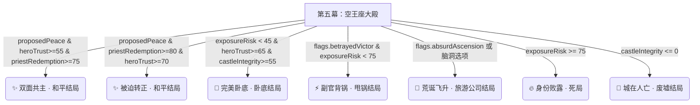

# 📋 What-If Life Simulator: 《假如我是勇者队伍里的卧底魔王》下游 MVP 完结总结与实施方案

> **项目名称**: What-If Life Simulator (`lit-pi/what-if`)  
> **剧本标识**: `undercover-demon-king` (假如我是勇者队伍里的卧底魔王)  
> **当前版本**: MVP 0.9.0 静态高保真原型 (已通过 Node 语法检查与 100% 全流程无缝验证)  
> **文档目的**: 为上游 Silicon Factory 人格包接入、大模型（LLM）裁决引擎开发及后续重构提供权威的剧本资产、场景树、角色模型、结局矩阵与实施方案交接。

---

## 一、 项目定位与现有代码资产

### 1.1 项目边界与原则 (遵照 AGENTS.md)
- **独立体验层**: 本项目是 `lit-pi/what-if` 体验侧，负责玩家交互、剧本场景流转、GM 裁决、AI 角色压力与结局结算。
- **轻量高保真原型**: 采用单页零依赖原生 Web 技术栈 (`index.html` + `src/app.js` + `src/styles.css`)，纯粹凭借 CSS 现代渲染（玻璃拟态、9:16 全屏电影级沉浸、JRPG 暗黑金边对话框、无缝预渲染）达到极高视觉质感。

### 1.2 源码与资产清单
- **运行时核心**: `src/app.js` (含 7 大场景树、13 重结局判定、12D 人格描述、状态量裁剪)
- **样式系统**: `src/styles.css` (含 9:16 移动端适配、黑幕平滑预渲染转场、JRPG 暗暗黑对话框、隐藏式灵感 Drawer)
- **图像资产**:
  - `assets/start_poster_v.png` (9:16 全屏首屏海报)
  - `assets/demon_castle_gate_v.png` (第一幕：魔王城正面大门)
  - `assets/collapsed_ruins.png` (第二幕：前庭坍塌废墟)
  - `assets/demon_dungeon_v.png` (第二幕：地下暗黑地牢)
  - `assets/forbidden_library_v.png` (第三幕：禁忌图书馆/符文密室)
  - `assets/demon_treasury_v.png` (第三幕：偏殿皇家宝库)
  - `assets/vanguard_corridor_v.png` (第四幕：近卫军决死长廊)
  - `assets/empty_throne_v.png` (第五幕：魔王空王座厅)
  - `assets/ending_demon_king_death.png` (当场伏诛/死亡结局血光 CG)
  - `assets/char_aslan.png` (主角阿斯兰：暗紫暗黑圣军师，100% 透明 BFS 抠图)
  - `assets/char_leon.png` (勇者莱昂：金甲圣剑)
  - `assets/char_ivette.png` (法师伊薇特：紫袍冷酷学者)
  - `assets/char_mira.png` (牧师米拉：悲悯圣光)
  - `assets/char_locke.png` (盗贼洛克：贪财机敏)
  - `assets/char_victor.png` (副官维克托：脑补忠臣)

---

## 二、 核心剧本与玩法闭环

### 2.1 剧本 Hook 与玩家设定
- **主角身份**: **阿斯兰 (我)** —— 第七代魔王（夜冠之主），伪装成流浪圣骑士混入勇者小队。
- **核心冲突**: 既要作为带头大哥领着勇者小队一路横推打自家大门，又要背地里帮呆萌部下打掩护，防止同伴怀疑爆雷。
- **胜利条件**: 不被当场抓包、保全魔王城并撑到王座大殿，给两界建立新秩序！

### 2.2 隐藏隐性指标系统 (0 ~ 100 硬裁剪)
1. `exposureRisk` (怀疑度/曝光风险): 达到 100 触发即时当场伏诛大结局。
2. `heroTrust` (勇者信赖度): 影响莱昂是否在关键时刻为你挡剑或反目。
3. `castleIntegrity` (城堡防线完整度): 决定结局时魔王城是安然无恙还是变成漏风废墟。
4. `mageEvidence` (法师证据链): 伊薇特搜集的古法术矛盾笔录。
5. `thiefLeverage` (盗贼把柄): 洛克掌握的黑料与金钱筹码。
6. `priestRedemption` (牧师感化度): 米拉对你悲悯品质的评价。
7. `victorMisread` (副官脑补度): 维克托过度配合导致的反向爆雷风险。
8. `butterflyDeviation` (蝴蝶效应/荒诞偏离度): 触发搞怪商业大结局的系数。

---

## 三、 完整 7 大幕数场景树 (每幕固定 3 选项)

每个场景固定提供 3 个特色选择（包含【稳妥】、【预设】、【陷阱】或【甩锅】），同时支持玩家自由文本对话输入：

| 幕数 | 场景 Key | 场景名称 & 地点 | 突发破绽事件 (Mishap) | 固定 3 选项 |
|---|---|---|---|---|
| **Act 1** | `gate` | 第一幕：魔王城正面大门 (`📍 魔王城正面大门`) | 门前血色防空阵灵识别你并高呼：“恭迎至高无上的魔王陛下归城！” | 1. `【学者胡扯】` 解释这是“因果诱导阵” 2. `【粗暴物理】` 一剑砍爆乱叫的阵灵 3. `【致命陷阱】` 顺口应声“平身吧” (死局) |
| **Act 2A**| `act2_ruins` | 第二幕：前庭坍塌废墟 (`📍 前庭坍塌废墟`) | 重伤的魔族小兵倒在石堆中向你伸手求救：“陛下……救我……” | 1. `【巧妙】` 魔族密音下达“装昏”封口令 2. `【粗暴甩锅】` 声张那是拟态怪伪装 3. `【致命陷阱】` 脱口喊出“辛苦了部下” (死局) |
| **Act 2B**| `act2_dungeon` | 第二幕：地下暗黑地牢 (`📍 地下暗黑地牢`) | 伊薇特翻出官方名册：“三年前的名册里根本没有你的登记记录！” | 1. `【严密逻辑】` 称修道院档案在火灾中烧毁 2. `【暗度陈仓】` 暗塞镏金放走绝密军官 3. `【致命陷阱】` 试图残忍灭口 (死局) |
| **Act 3A**| `act3_library` | 第三幕：禁忌图书馆 (`📍 禁忌图书馆/符文密室`)| 伊薇特把失传的三千年前古籍拍在桌上：“古书籍记载圣骑士根本不会这门禁咒！” | 1. `【胡编乱造】` 辩称是自创流派 2. `【暴力破局】` 一记圣光斩打爆真名石板 3. `【致命陷阱】` 编造漏洞百出的法术假谎言 (死局) |
| **Act 3B**| `act3_treasury` | 第三幕：偏殿皇家宝库 (`📍 偏殿皇家宝库`) | 盗贼洛克撬开了魔王城堡宝库，正疯狂往口袋装你积攒三年的私房钱！ | 1. `【巧妙】` 指引洛克去拿幻术假金币宝箱 2. `【正色劝导】` 义正严词引向神兵库兵器架 3. `【致命陷阱】` 失控喊“那是我修水管的私房钱！” (死局) |
| **Act 4** | `act4_corridor` | 第四幕：近卫军决死长廊 (`📍 近卫军决死长廊`)| 副官维克托挥剑狂呼：“为了陛下！全军自爆与人类同归于尽！” | 1. `【巧妙】` 暗中展示魔王戒章暗号平息自爆 2. `【正面顶盾】` 张开圣光结界强行压制 3. `【致命陷阱】` 假戏真做强杀副官维克托 (死局) |
| **Act 5** | `act5_throne` | 第五幕：魔王空王座厅 (`📍 魔王空王座厅`) | 墙上巨幅魔王雕像露出了真容，全队退后三步死死盯着你与雕像！ | 1. `【和平方案】` 正式提出两界共治与停战草案 2. `【甩锅大计】` 当场推给副官维克托 3. `【高概念脑洞】` 提出“将魔王城改造成主题乐园” |

---

## 四、 13 重确定性结局矩阵 (Endings Matrix)

结局根据玩家的隐性指标及旗标触发，分为 **即时死局结局**、**硬失败结局**、**真和平结局**、**卧底结局**、**甩锅结局** 与 **荒诞结局**：

### 结局详细列表：
1. **`gate_exposure_ending` (第一幕：阵灵跪拜·当场伏诛)** [即时死局]
2. **`ruins_arrest_ending` (第二幕：前庭失口·当场逮捕)** [即时死局]
3. **`dungeon_rupture_ending` (第二幕：地牢残忍·众叛亲离)** [即时死局]
4. **`library_seal_ending` (第三幕：真名曝光·图书馆封印)** [即时死局]
5. **`treasury_confess_ending` (第三幕：私房钱暴走·身份败露)** [即时死局]
6. **`corridor_betrayal_ending` (第四幕：决死长廊·自爆反噬)** [即时死局]
7. **`exposed` (身份败露)** [硬失败结局]
8. **`castleLost` (城在人亡)** [硬失败结局]
9. **`dualRuler` (双面共主)** [真·和平结局]
10. **`redeemed` (被迫转正)** [真·和平结局]
11. **`perfectSpy` (完美卧底)** [高分卧底结局]
12. **`victorBlamed` (副官背锅)** [甩锅搞笑结局]
13. **`absurdAscension` (荒诞飞升)** [高概念主题乐园结局]

---

## 五、 大模型 (LLM) 接入与 Silicon Factory 适配方案

已在 [llm-adjudication-and-storyline-progression-architecture.md](file:///Users/coding-pi/Documents/Workspaces/Main/Lit-Pi/what-if/docs/specs/llm-adjudication-and-storyline-progression-architecture.md) 落地架构设计：

1. **混合双引擎 Guardrail 模式**:
   - LLM 负责自由文本理解、GM 旁白生成与 5 位 Agent 的性格对话。
   - 运行时负责数值 `Math.min(100, Math.max(0, current + delta))` 裁剪与结局触发拦截。
2. **Silicon Factory 人格模型 (12D Model)**:
   - 注入莱昂 (勇者)、伊薇特 (法师)、米拉 (牧师)、洛克 (盗贼)、维克托 (副官) 的 `valuesAndBeliefs` 与 `stressTriggers`，使 Agent 根据角色底线做出反制或动摇。

---

## 六、 下游 Agent 重构与实施路线图 (Implementation Roadmap)

对后续负责重构的 Agent 建议按以下步骤进行：

- [x] **阶段一：MVP 高保真原型搭建 (已完成)**
  - 7 大幕数场景、13 重结局、全套透明 PNG 角色立绘、极简 UI 与隐藏式 Drawer 全部就位。
- [ ] **阶段二：上游 API/LLM 接入 (待实施 Agent 执行)**
  - 实现 `adjudicateFreeAction(inputText)` 的后端/Serverless LLM API 调用。
  - 配置 JSON Schema Structured Output 解析与降级 Fallback 机制。
- [ ] **阶段三：角色底线 (Red Line) 对峙机制强化**
  - 在第五幕逻辑中加入 `verifyCharacterRedLines(stats, flags)`，若触碰莱昂正义底线或米拉零无辜者伤亡底线，自动触发特定对峙话语与分支结局。
- [ ] **阶段四：单元测试与确定性 QA 覆盖**
  - 为 13 个结局的触发路径编写 Node 自动化测试，确保每个结局都有文档化的确定性阈值。
